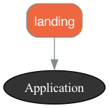

# Modular Monolith

This project serves as a learning resource for organizing a modular monolith Rails application using `rails-pack` and `packwerk`.

Within the `packs` folder, we have two applications: `landing` and `authentication`.

# Checklist

- [x] **Multiple modules structure:** The application is divided into multiple modules.
- [x] **Multiple databases:** Each module has its own database.
- [x] **Migration for each module:** Database migrations are set up for each module.
- [x] **Set up packwerk for boundaries:** Packwerk is used to enforce boundaries between modules.
- [x] **Module has its own config/routes file:** Each module has its own routes configuration.
- [ ] **Test and how to run tests:** (This item is pending. Add a description when it's done.)

# Multiple Modules Structures

In this application, we've adopted a modular structure. This means that the application is divided into multiple modules, each responsible for a distinct feature of the application.

The modules in this application are contained within the `packs` folder.
Currently, we have two modules: `landing` and `authentication`.

- The `landing` module handles the landing page of the application.
- The `authentication` module manages user authentication (for ex: including sign up, log in, and log out functionality).

Each module is structured as a mini Rails application, with its own models, views, controllers, and routes. This allows each module to operate independently, improving the maintainability and scalability of the application.

The diagram below provides a visual representation of how these modules interact within the application:



This is steps to setup multiple module structures with `rails-packs`

1. Add the required gems to the Gemfile:

```ruby
gem 'packs-rails'
gem 'packwerk'
```

2. Initialize packwerk

```ruby
bundle binstub packwerk
bin/packwerk init
```

### `Landing` app

1. Create a new location for the `landing` module:

First, create a `packs` folder at the root of your project.
Inside the `packs` folder, create a `landing` folder.

2. Create a Landing page

```
bin/rails g controller landing index
```

3. Move the controllers, views, and helpers related to the `landing` page into the new `landing` app in folder `packs`.
   Ensure that the file structure within the landing module follows the standard Rails conventions.

4. Create `package.yml` to configure the package

```ruby
# Turn on dependency checks for this package
enforce_dependencies: true

# Turn on privacy checks for this package
enforce_privacy: true

# this allows you to modify what your package's public path is within the package
public_path: public/

# A list of this package's dependencies
# Note that packages in this list require their own `package.yml` file
dependencies:
- '.
```

# Multiple Databases

In keeping with the modular structure of our application, we've also adopted a multiple database approach.

This means that each module in the application has its own dedicated database. This allows each module to manage its own data independently, further enhancing the separation of concerns within our application.

For instance, the `authentication` modules each have their own databases which manages data related to user accounts and authentication.

This approach has several benefits:

- **Isolation:** Each module's data is isolated from the others, reducing the risk of data corruption.
- **Scalability:** It's easier to scale a specific module's database as the module's data needs grow.
- **Maintainability:** Database schema changes in one module won't affect the others, making the application easier to maintain.

Here's an example of how it's set up for the `development` environment:

```yaml
development:
  primary:
    <<: *default
    database: rails_pack_packwerk_development
    host: localhost
    port: 5432
    username: postgres
    password: 123
  authentication:
    <<: *default
    database: rails_packs_authentication_development
    host: localhost
    port: 5432
    username: postgres
    password: 123
    migrations_paths: db/authenticate_migrate
```

In this configuration:

- `primary` is the main database for the application.
- `authentication` is the database specifically for the authentication module.

# Migration for each module

The `migrations_paths` option in the authentication database configuration specifies the path to the migrations for the authentication module. This allows Rails to correctly locate the migrations for each module.

The migration command for the `primary` database is:

```
bin/rails db:migrate:primary
```

The migration command for the `authentication` database is:

```
bin/rails db:migrate:authentication
```

For example, if we want to create a `users` table for the `authentication` module, we would use the following command:

```
rails generate model User id:primary_key name:string email:string --database authentication
```

Then, to run the migration specifically for the `authentication` module, we would use:

```
bin/rails db:migrate:authentication
```

# Setting Up Packwerk for Boundaries

Packwerk has already been installed in our project. It's used to enforce boundaries between different parts of our application.

To verify that our packages (modules) have been clearly and correctly defined, you can run the following command:

```bash
bin/packwerk check
```

In case, you want to visualize your package design, using graphwerk

```bash
bundle add graphwerk
gem 'graphwerk', group: %i[development test]
bundle install
bundle exec rake graphwerk:update
```

Now you can open `packwerk.png` and see the code structure and dependencies.


# Each Module Has Its Own config/routes File

In our application, each module has its own configuration and routes file. This allows each module to define its own settings and URL routing independently from the rest of the application, enhancing the separation of concerns and making the modules more self-contained.

For instance, the `landing` module might have a `config/routes/landing.rb` file that defines the routes for the landing page, while the `authentication` module might have its own `config/routes/authentication.rb` file that defines the routes for sign up, log in, and log out functionality.

Here's an example of what an app's `config/routes.rb` file might look like:

```ruby
Rails.application.routes.draw do
  draw :landing
  draw :authentication
end
```

The `landing` module's route configuration might look like this:

```ruby
scope :landing do
  get '/index', to: 'landing#index'
end

```

You can view the landing page at the following URL: http://localhost:3000/landing/index

The `authentication` module's route configuration might look like this:

```ruby

scope :authentication do
  resources :users
end

```

You can view the user list page at the following URL: http://localhost:3000/authentication/users
