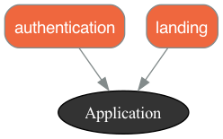

# Modular Monolith

This project serves as a learning resource for organizing a modular monolith Rails application using `rails-pack` and `packwerk`.

Within the `packs` folder, we have two applications: `landing` and `authentication`.

# Checklist

- [x] **Multiple modules structure:** The application is divided into multiple modules.
- [x] **Multiple databases:** Each module has its own database.
- [x] **Migration for each module:** Database migrations are set up for each module.
- [x] **Set up packwerk for boundaries:** Packwerk is used to enforce boundaries between modules.
- [x] **Module has its own config/routes file:** Each module has its own routes configuration.
- [ ] **Test and how to run tests:** (This item is pending. Add a description when it's done.)

# Multiple Modules Structures

In this application, we've adopted a modular structure. This means that the application is divided into multiple modules, each responsible for a distinct feature of the application. This structure helps us maintain a high level of organization and separation of concerns within the codebase.

The modules in this application are contained within the `packs` folder. Currently, we have two modules: `landing` and `authentication`.

- The `landing` module handles the landing page of the application.
- The `authentication` module manages user authentication, including sign up, log in, and log out functionality.

Each module is structured as a mini Rails application, with its own models, views, controllers, and routes. This allows each module to operate independently, improving the maintainability and scalability of the application.

The diagram below provides a visual representation of how these modules interact within the application:



# Multiple Databases

In keeping with the modular structure of our application, we've also adopted a multiple database approach. This means that each module in the application has its own dedicated database. This allows each module to manage its own data independently, further enhancing the separation of concerns within our application.

For instance, the `authentication` modules each have their own databases which manages data related to user accounts and authentication.

This approach has several benefits:

- **Isolation:** Each module's data is isolated from the others, reducing the risk of data corruption.
- **Scalability:** It's easier to scale a specific module's database as the module's data needs grow.
- **Maintainability:** Database schema changes in one module won't affect the others, making the application easier to maintain.

Our application uses a multiple database setup, with each module having its own dedicated database. This is configured in the `database.yml` file. Here's an example of how it's set up for the `development` environment:

```yaml
development:
  primary:
    <<: *default
    database: rails_pack_packwerk_development
    host: localhost
    port: 5432
    username: postgres
    password: 123
  authentication:
    <<: *default
    database: rails_packs_authentication_development
    host: localhost
    port: 5432
    username: postgres
    password: 123
    migrations_paths: db/authenticate_migrate
```

In this configuration:

- `primary` is the main database for the application.
- `authentication` is the database specifically for the authentication module.

# Migration for each module

The `migrations_paths` option in the authentication database configuration specifies the path to the migrations for the authentication module. This allows Rails to correctly locate the migrations for each module.

This setup allows each module to manage its own data independently, enhancing the separation of concerns within our application.

The migration command for the `primary` database is:

```
bin/rails db:migrate:primary
```

The migration command for the `authentication` database is:

```
bin/rails db:migrate:authentication
```

For example, if we want to create a `users` table for the `authentication` module, we would use the following command:

```
rails generate model User id:primary_key name:string email:string --database authentication
```

Then, to run the migration specifically for the `authentication` module, we would use:

```
bin/rails db:migrate:authentication
```
